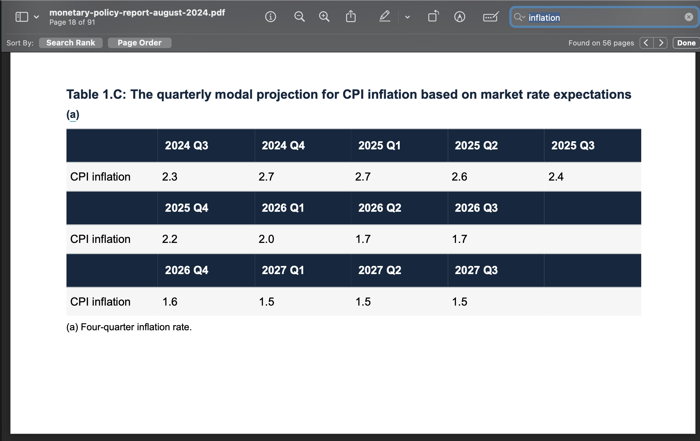

# Hack Prep

Repository for hack prep.


> **Warning**
> Due to token limitations, it is highly recommended to only choose relevant files.


## Desired Goal State


### Current Document RAG State


## Installation

PDFNinja has certain dependencies and was compiled in Python3.9 but shoudl have backward and forward compatibility. The other dependencies are listed in requirements.csv
```bash
$ pip install -r requirements.txt
```

## Usage
You can call the app right from the command line interface. 

### Pre-processing

[//]: # (1. Obtain an API key from OpenAI.)

[//]: # (2. Store it as a string in a .txt file)

[//]: # (3. This is parsed to the program using the --apikey_filepath argument.)

[//]: # (4. Have the folder where you want to search for pdf documents as a directory path as well. This will be parsed to the program using --documents_path argument.)

### Run from terminal

```bash
streamlit run main.py
# returns the workflow with default args in streamlit
```

### See an interactive of this below
<table>
  <tr>
    <td></td>
    <td></td>
  </tr>
  <tr>
    <td></td>
    <td></td>
  </tr>
  <tr>
    <td></td>
    <td></td>
  </tr>
</table>


[//]: # (![alt text]&#40;assets/SS_1.png&#41;)

[//]: # (![alt text]&#40;assets/SS_2.png&#41;)

[//]: # (![plot_output.png]&#40;assets%2Fplot_output.png&#41;)

[//]: # (![doccomparison.png]&#40;assets%2Fdoccomparison.png&#41;)

[//]: # (![Screenshot 2024-11-10 at 10.18.20 PM.png]&#40;assets%2FScreenshot%202024-11-10%20at%2010.18.20%E2%80%AFPM.png&#41;)

[//]: # (![Screenshot 2024-11-10 at 10.18.41 PM.png]&#40;assets%2FScreenshot%202024-11-10%20at%2010.18.41%E2%80%AFPM.png&#41;)
### Demo app


